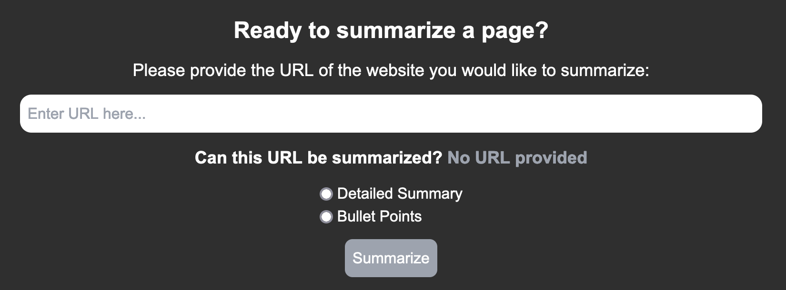

# Automating Video Scripts

The goal of this project is to create a website that makes the video script creating easier by providing helpful tools.

### Dashboard Tab

This tab lets you create, delete, and view which scripts you already have! The top section of it shows you a preview of the three most recently viewed scripts along with an optionto create one.
The table below that shows you all of your scripts and lets you sort them by name or most recently edited.

***

### Brainstorm Tab

This tab let's create a script based on a topic idea that you have. You can even create one based on a random topic as well. After you either type in a topic or select the random topic option you will be redirected to a new script. From there the script will have text based on the topic you selected.

***

### Summarize Tab

This tab let's you summarize a web page by providing a URL. This scrapes the website (if allowed) and returns a summary of the site. The summary is shown in a modal which you can copy with the click of a button.

***

### Script Tab

This tab let's you edit a script. This is the tab where you can write out a script for your video.

